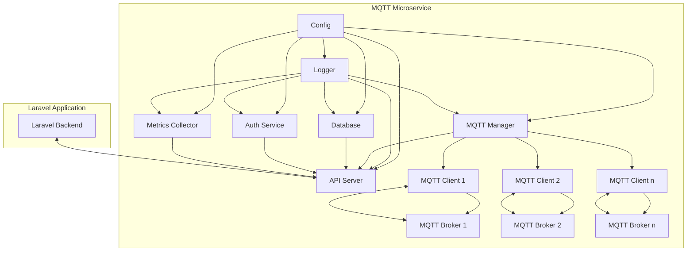
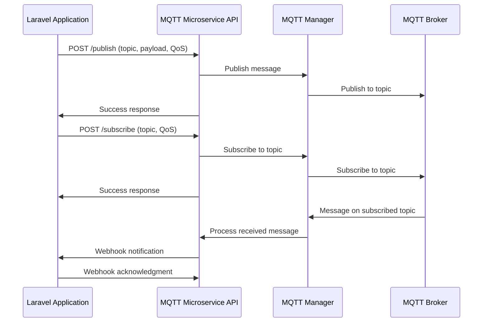
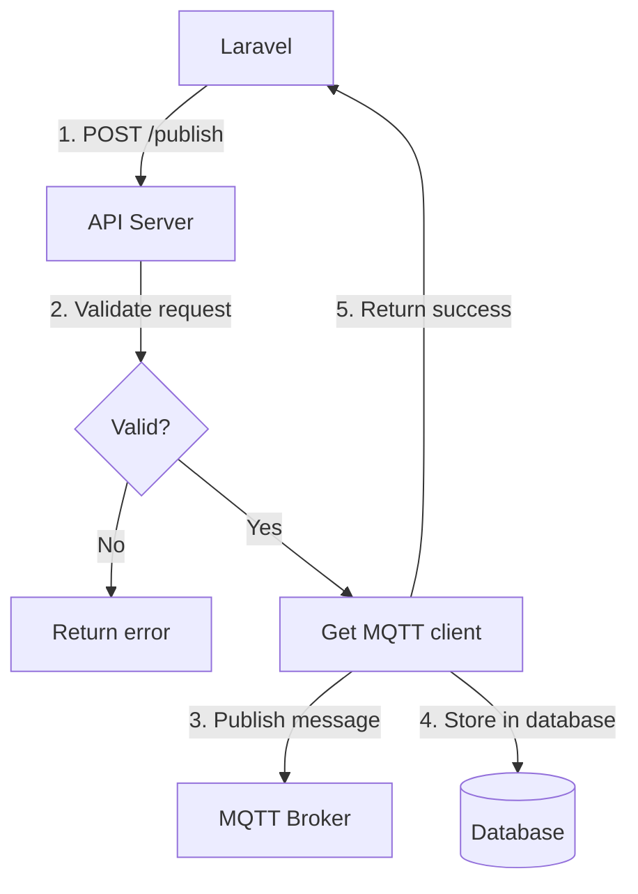
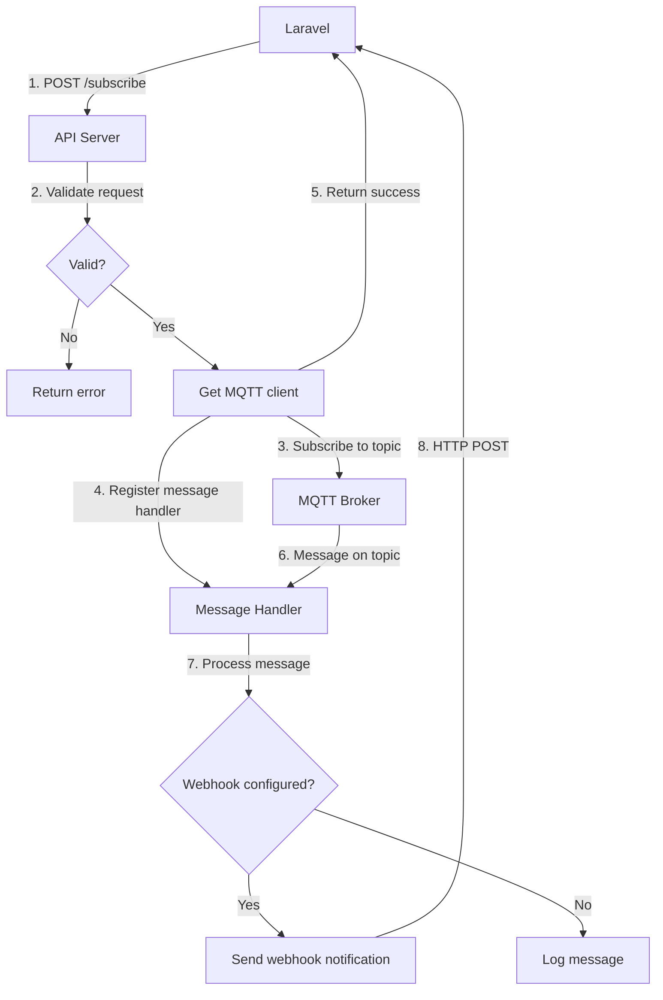
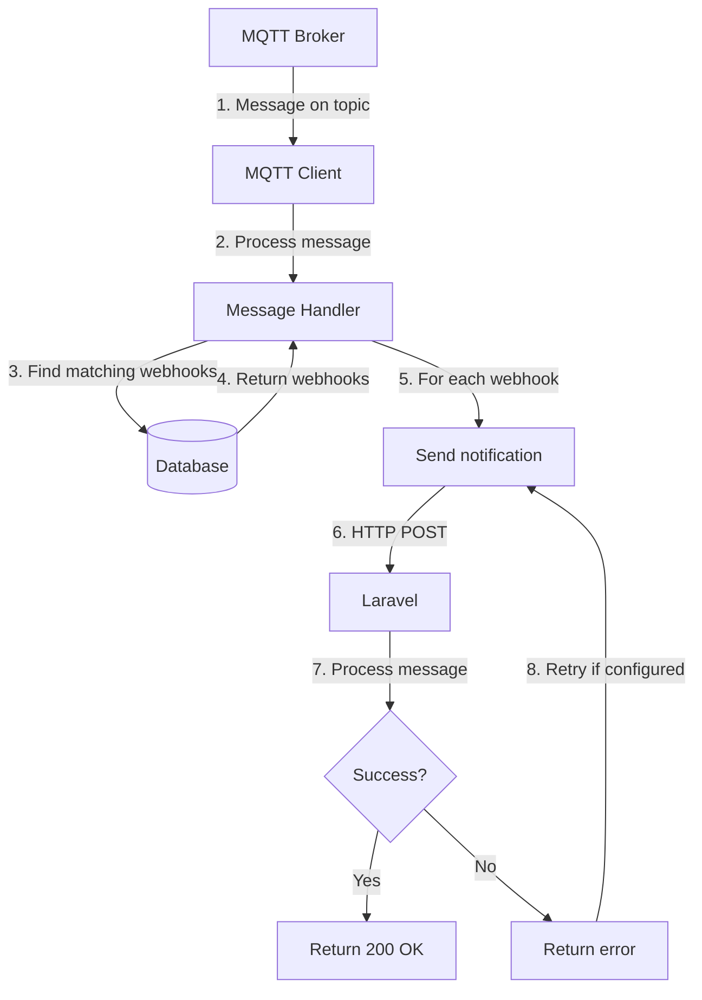
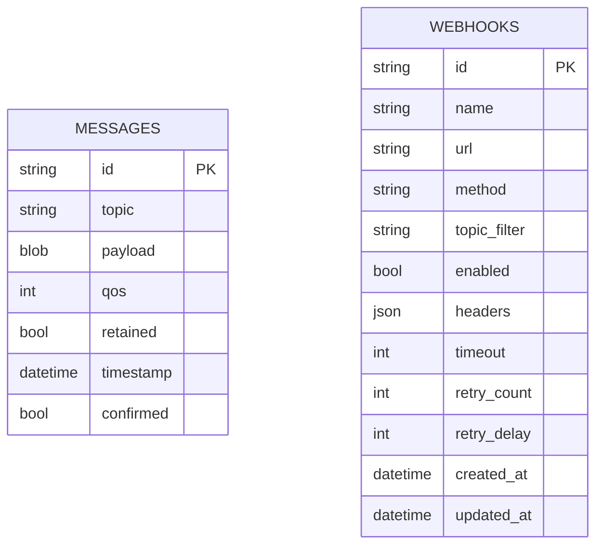
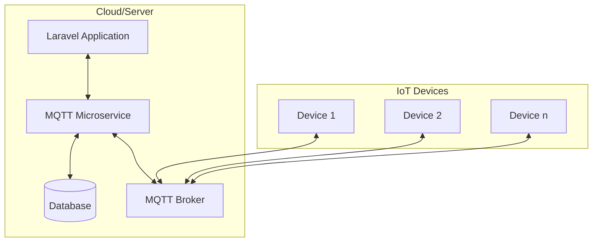

# MQTT Microservice Architecture

This document provides a visual representation of the MQTT Microservice architecture using Mermaid diagrams. It illustrates the components, their relationships, and the communication flow between the microservice and Laravel.

## Overall Architecture

The MQTT Microservice is built with a clean, modular architecture consisting of several key components that work together to provide MQTT functionality to Laravel applications.

### Component Description

1. **Config**: Loads and validates configuration from environment variables
2. **Logger**: Provides structured logging throughout the application
3. **MQTT Manager**: Manages connections to multiple MQTT brokers
4. **API Server**: Exposes HTTP endpoints for Laravel to interact with
5. **Database**: Stores messages and webhook configurations
6. **Auth Service**: Handles API key authentication
7. **Metrics Collector**: Tracks performance and usage metrics
8. **MQTT Clients**: Connect to MQTT brokers and handle messaging
9. **MQTT Brokers**: External MQTT servers (HiveMQ, Mosquitto, etc.)

## Communication with Laravel

The MQTT Microservice communicates with Laravel in two ways:
1. Laravel makes HTTP requests to the microservice's API endpoints
2. The microservice sends webhook notifications to Laravel when messages are received

## Data Flow for Key Operations

### Publishing a Message

### Subscribing to a Topic

### Webhook Notifications

## Database Schema

The microservice uses a database to store messages and webhook configurations. The schema is as follows:

## Deployment Architecture

The MQTT Microservice can be deployed in various ways, depending on the requirements. Here's a typical deployment architecture:

This architecture allows Laravel to offload all MQTT communication to the microservice, which handles the complexities of MQTT protocols, connection management, and message processing.