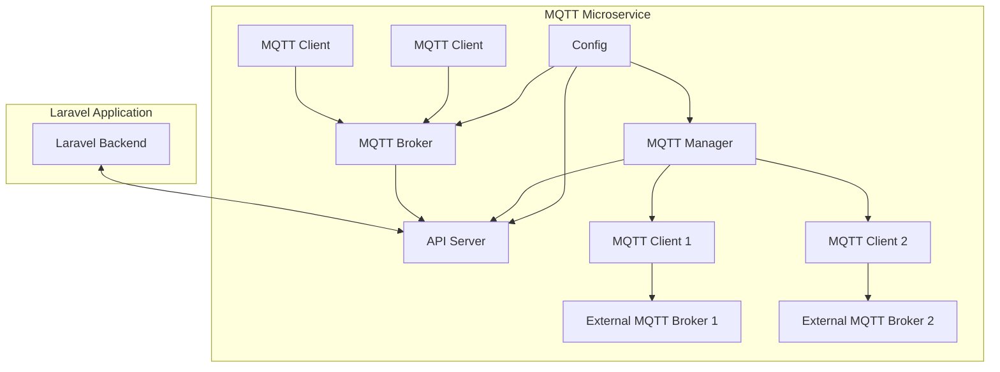
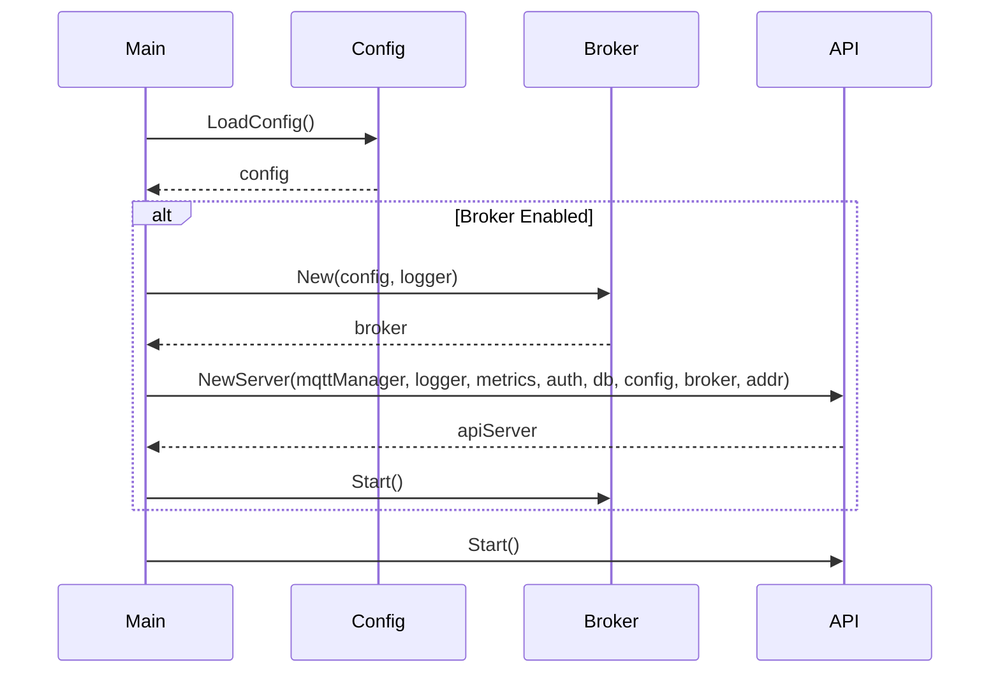
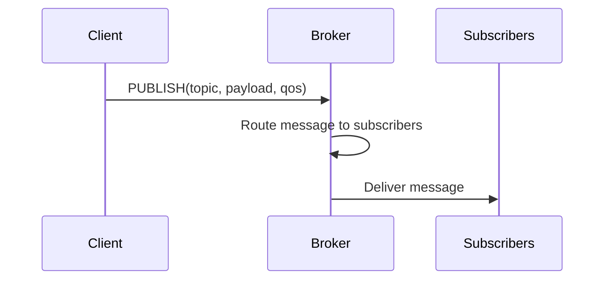
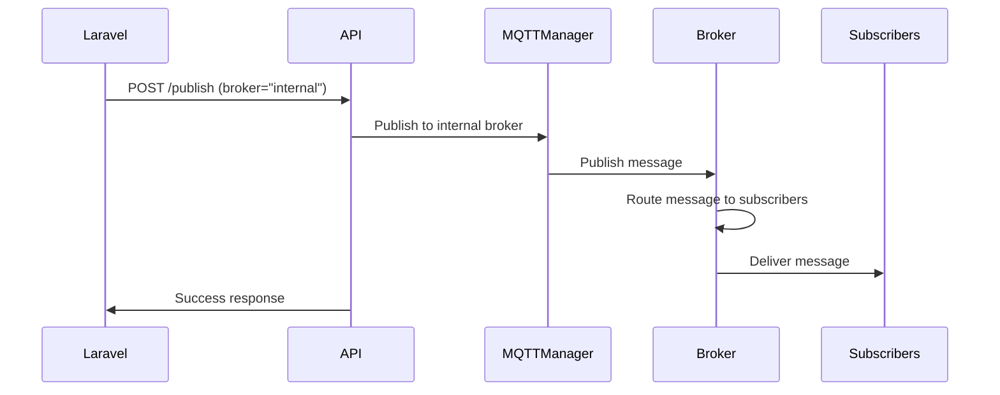
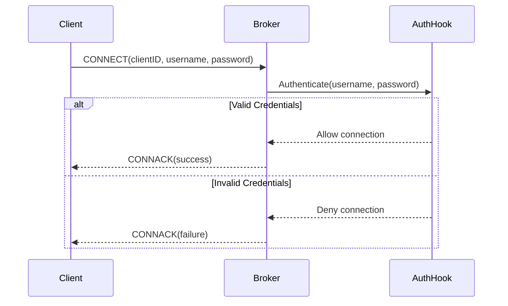

# MQTT Broker Architecture

This document explains the architecture of the built-in MQTT broker in the MQTT microservice and how it integrates with the rest of the system.

## Architecture Overview

The MQTT microservice is designed with a modular architecture that allows it to function as both an MQTT client (connecting to external brokers) and an MQTT broker (accepting connections from clients). This dual functionality provides flexibility in how the microservice can be deployed and used.



## Component Breakdown

### 1. MQTT Broker (`internal/broker`)

The MQTT broker is implemented using the [Mochi MQTT](https://github.com/mochi-mqtt/server) library. It provides the following functionality:

- **TCP Listener**: Accepts MQTT connections on the configured port
- **TLS Support**: Optional TLS encryption for secure connections
- **Authentication**: Optional username/password authentication
- **Topic Routing**: Routes messages between connected clients

The broker is encapsulated in the `Broker` struct, which provides methods for starting, stopping, and checking the status of the broker.

```
// Broker struct definition
type Broker struct {
    config  *Config
    logger  *logger.Logger
    server  *mqtt.Server
    mu      sync.RWMutex
    running bool
}
```

### 2. Configuration (`internal/config`)

The configuration for the MQTT broker is loaded from environment variables and stored in the `MQTTBrokerConfig` struct:

```
// MQTTBrokerConfig struct definition
type MQTTBrokerConfig struct {
    Enable         bool
    Host           string
    Port           int
    TLSEnable      bool
    TLSCertFile    string
    TLSKeyFile     string
    AuthEnable     bool
    AllowAnonymous bool
    Credentials    map[string]string
}
```

This configuration is then converted to the broker's internal `Config` struct when initializing the broker.

### 3. API Integration (`internal/api`)

The API server exposes endpoints for interacting with the MQTT broker:

- `GET /broker/status`: Returns the status of the broker

The API server holds a reference to the broker instance and can call its methods to retrieve status information.

## Initialization Flow

1. The main application loads the configuration from environment variables
2. If the broker is enabled, it initializes a new broker instance
3. The broker instance is passed to the API server
4. The broker is started when the application starts



## Message Flow

### Publishing a Message to the Broker

When a client publishes a message to the broker, the following flow occurs:



### API-Based Publishing

The microservice also allows publishing messages to the broker via the API:



## Authentication Flow

If authentication is enabled, the broker validates client credentials during the connection process:



## Design Decisions

### Why a Built-in Broker?

Including a built-in MQTT broker in the microservice provides several advantages:

1. **Simplified Deployment**: No need to deploy and manage a separate MQTT broker
2. **Reduced Latency**: Direct communication between the microservice and MQTT clients
3. **Unified Management**: Single point of configuration and monitoring
4. **Flexibility**: Can be used alongside external brokers or as a standalone broker

### Why Mochi MQTT?

The [Mochi MQTT](https://github.com/mochi-mqtt/server) library was chosen for the following reasons:

1. **Pure Go Implementation**: No external dependencies or CGO requirements
2. **Performance**: Designed for high throughput and low latency
3. **Feature-Rich**: Supports most MQTT features needed for this application
4. **Active Development**: Regularly updated and maintained
5. **Embeddable**: Designed to be embedded in other applications

## Limitations and Future Improvements

### Current Limitations

1. **No Persistent Sessions**: Client sessions are not persisted across broker restarts
2. **No Retained Messages**: Retained messages are not currently supported
3. **Limited Authentication**: Only simple username/password authentication is supported
4. **No Access Control Lists**: No fine-grained control over topic access

### Potential Future Improvements

1. **Persistent Storage**: Add support for persisting sessions and retained messages
2. **Enhanced Authentication**: Support for JWT or certificate-based authentication
3. **Access Control Lists**: Fine-grained control over who can publish/subscribe to which topics
4. **Bridge Functionality**: Automatically bridge between the internal broker and external brokers
5. **Metrics and Monitoring**: More detailed metrics about broker performance and usage

## Conclusion

The built-in MQTT broker is a powerful addition to the MQTT microservice, providing flexibility and simplifying deployment. Its modular design allows it to be easily extended and integrated with the rest of the system.
